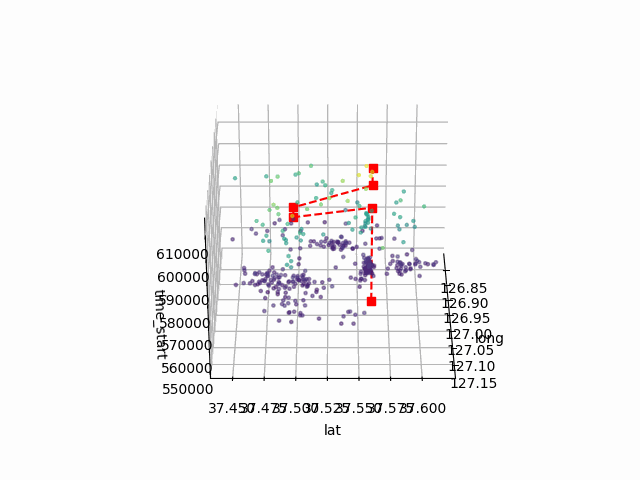
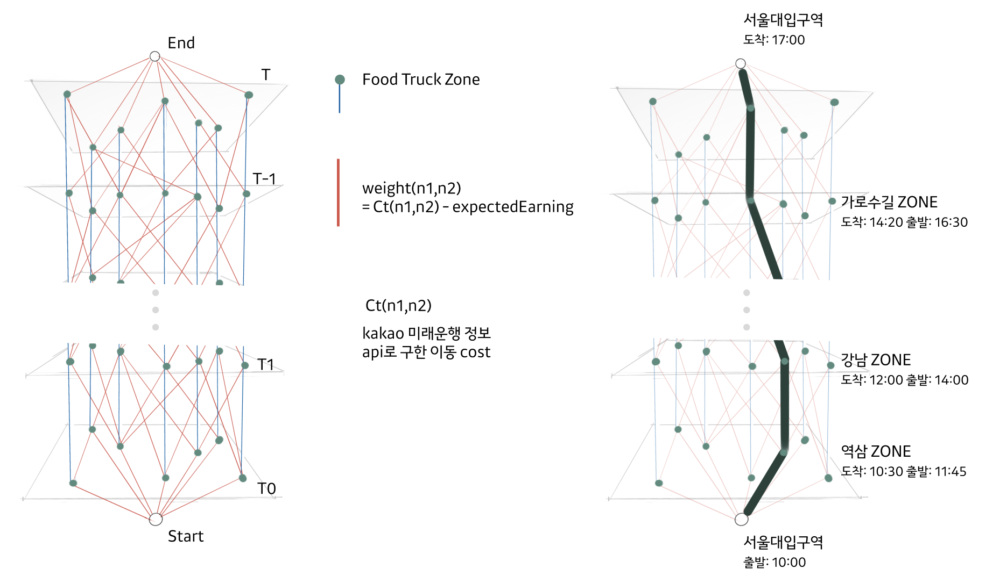

# Bobusang Algorithm Demo
### Team: 무궁화맨숀
### Service: Bobusang
## Objectivs
Identify the most revenue-optimal route for food truck operators!!

## Problem Formulation
We aim to design a route for food truck operators that yields the highest earnings, taking into account customer demand, average earnings per customer, and transportation costs.

Customers submit multiple requests (D) for food trucks to visit their vicinity.

 Demands D include:
  - The desired parking lot ID: p_i
  - The preferred time slot: [t_requested^start, t_requested^end]

## Methods
We begin by constructing a directed graph representing both geographical and temporal dimensions. Each node corresponds to an available parking lot at a specific time.
Additionally, we include a 'start' (-1) node to represent the driver's initial position and an 'end' (-2) node to denote their final location, which is most likely their home or overnight parking space."

The time intervals represented by these nodes are determined by dividing the food truck's operating hours by a predefined time interval.

Then, for each node, edges are added to connect to available routes, including its own, while taking into account the traffic conditions specific to the date and time associated with that node. Each edge's weight is calculated as the travel cost minus the potential earnings during the time interval between two nodes.

Lastly, the optimal route is identified using the Bellman-Ford algorithm, which minimizes the cumulative edge costs between the start and end nodes.

### Calculation of traveling cost.
To calculate the weight of each edge accurately, it's essential to determine the cost of traveling. The distance and time for travel are estimated using the Future Direction API provided by KAKAO Mobility Developer[1]. To optimize the number of API calls, the results from this API are stored and reused when needed.

 
  <figcaption>Fig. 1: Revenue optimized path.</figcaption>

 
  <figcaption>Fig. 2: Graph illustration.</figcaption>

# Ref
[1] https://developers.kakaomobility.com/
